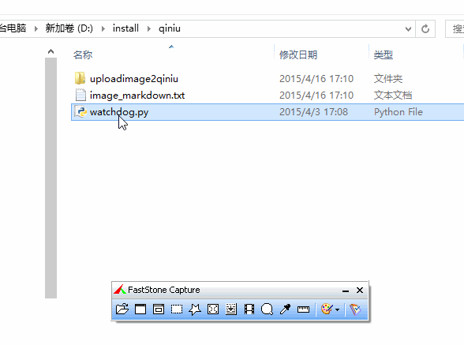

#打造自己的图床(qiniu)



###流程

> python 监控文件夹 --> 文件新增(FS capture 截图自动保存该目录)
--> 使用 qiniu sdk 上传到 qiniu 云存储 --> 生成外链到粘贴板 --> 复制图片外链到博客


##安装步骤
pip install qiniu4blog

> win8 下 python2.7.9 下验证通过,其它版本还未测试
> 或使用单独的脚本`watchdog.py` ---> `old目录下`

##配置

登录[https://portal.qiniu.com/](https://portal.qiniu.com/)
新建一个**bucket**,获取以下相关信息


在home目录下新建配置文件`qiniu.cfg` 例如`C:\Users\leeyoung\qiniu.cfg`

`qiniu.cfg`内容如下
```
[config]
bucket = voyager91
accessKey = qzA***********************
secretKey = P5G***********************
path_to_watch = D:\install\qiniu\uploadimage2qiniu

```

> mac 系统设置截图自动保存文件夹

```
defaults write com.apple.screencapture location /Users/leeyoung/Desktop/up2qiniu
killall SystemUIServer
```

##运行
 
打开终端或cmd
```
qiniu4blog
```


##相关下载
* [FastStone Capture.rar](http://pan.baidu.com/s/1o6mjrmi)

> 设置自动保存路径 settings -> Auto Save -> Output folder